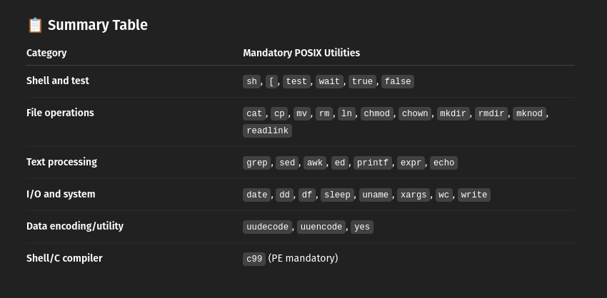

# Recreating UNIX commands as a way to learn C.

Recently I became interested in C programming and I was looking for an effective way to learn it. I followed couple of tutorials online that covered recreating
various technologies, such as shell or terminal-based text editor, but those didn't make it really click for me. After picking up [this book](https://man7.org/tlpi/index.html) on Linux system API, I decided that the most effective and interesting way to learn about C and Linux would be to recreate every command listed in the [POSIX.1-2008 standard specification](https://pubs.opengroup.org/onlinepubs/9699919799/utilities/V3_chap01.html). 

## TODO

- [ ] Add help option to all commands

## Completed commands

Listed but unchecked commands are WIP. Checked commands are fully completed.

- [X] **cat** - included flags: v, T, E, A, n
- [X] **cp** - included flags: r, v, P, s, f
- [X] **rm** - included flags: r, v, f; no prompting
- [ ] **mv** - WIP, implemented v, h, t 
